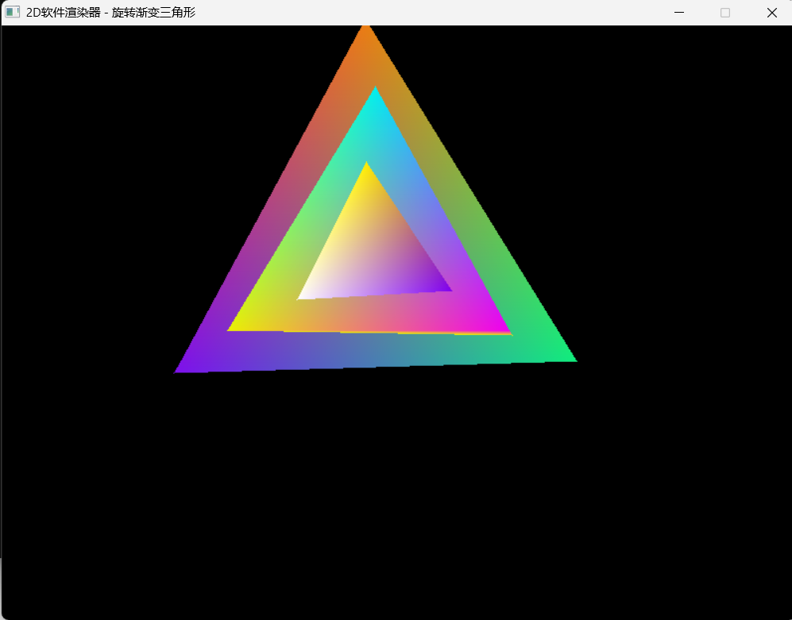

# 2D软件渲染器 - 旋转渐变三角形Demo

一个从零开始实现的纯软件2D渲染器，不依赖任何图形API的渲染功能，仅使用SDL2绘制单个像素。

## ✨ 项目亮点
- **纯软件实现**：所有渲染算法完全手写，不使用OpenGL/DirectX
- **扫描线三角形填充**：支持任意形状、任意角度的实心三角形
- **Gouraud着色**：实现逐像素颜色插值，生成平滑的渐变效果
- **鲁棒性设计**：自动处理顶点顺序，支持所有边界情况
- **实时动画系统**：与帧率无关的匀速旋转和呼吸缩放效果
- **鼠标交互**：三角形中心跟随鼠标移动
- **高性能**：优化了浮点数运算，800x600分辨率下稳定100FPS

## 🎮 运行截图


## 🛠️ 编译运行
### 依赖
- C++11及以上编译器
- SDL2开发库

### Windows编译（MinGW）
```bash
g++ main.cpp -o renderer -lSDL2main -lSDL2 -std=c++11 -O2
### Linux 编译
```bash
g++ main.cpp -o renderer `sdl2-config --cflags --libs` -std=c++11 -O2
###运行
```bash
./renderer
##📁项目结构
```plaintext
.
├── main.cpp          # 所有代码都在这一个文件中，方便编译和学习
├── README.md         # 项目说明文档
└── screenshot.png    # 运行截图
🧠 核心算法
Bresenham 直线算法：高效绘制任意斜率的直线
扫描线三角形填充：将任意三角形拆分为平顶和平底三角形，逐行扫描填充
Gouraud 着色：先在斜边上插值颜色，再在水平线上插值每个像素的颜色
坐标变换：实现顶点的缩放、旋转和平移变换
与帧率无关的动画：基于系统时间计算动画状态，保证不同设备上速度一致
📚 学习收获
通过这个项目，我深入理解了：
计算机图形学的基础渲染管线
2D 坐标变换和矩阵运算
软件渲染器的性能优化方法
实时动画系统的设计原理
SDL2 库的基本使用
📝 开发日志
5.9：实现 Bresenham 直线算法和轴对齐直角三角形填充
5.10：实现通用任意三角形填充算法
5.11：添加 Gouraud 着色，支持渐变三角形
5.12：性能优化和全面测试
5.13：实现实时动画系统和三角形旋转
5.14：添加鼠标跟随、呼吸缩放和动态颜色效果
5.15：项目收尾，上传 GitHub


